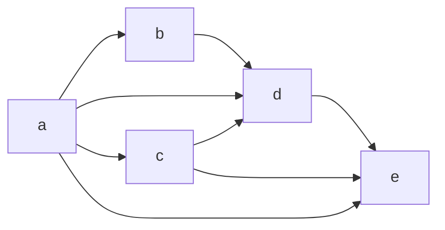

# algo-toposort

[Topological sort](https://en.wikipedia.org/wiki/Topological_sorting) implementing
[depth-first search](https://en.wikipedia.org/wiki/Depth-first_search) algorithm
([Tarjan](https://en.wikipedia.org/wiki/Robert_Tarjan) 1976).

# Install

```shell
composer require vertilia/algo-toposort
```

# Usage

Example tree to sort topologically:



Call with array passed in constructor:

```php
$values = [
    'a' => ['b', 'd', 'c', 'e'],
    'b' => ['d'],
    'c' => ['d', 'e'],
    'd' => ['e'],
    'e' => [],
];

$a = new TopoSort($values);

$sorted = $a->sort();

print_r($sorted);
```

Call by forming initial array via `addNode()` calls:

```php
$a = new TopoSort();

$a->addNode('a', ['b', 'd', 'c', 'e'])
    ->addNode('b', ['d']),
    ->addNode('c', ['d', 'e']),
    ->addNode('d', ['e']),
    ->addNode('e', []);

$sorted = $a->sort();

print_r($sorted);
```


Call by forming initial array via `addLink()` calls:

```php
$a = new TopoSort();

$a->addLink('a', 'b')
    ->addLink('a', 'd'),
    ->addLink('a', 'c'),
    ->addLink('a', 'e'),
    ->addLink('b', 'd'),
    ->addLink('c', 'd'),
    ->addLink('c', 'e'),
    ->addLink('d', 'e');

$sorted = $a->sort();

print_r($sorted);
```

Output:

```
Array
(
    [0] => a
    [1] => c
    [2] => b
    [3] => d
    [4] => e
)
```
